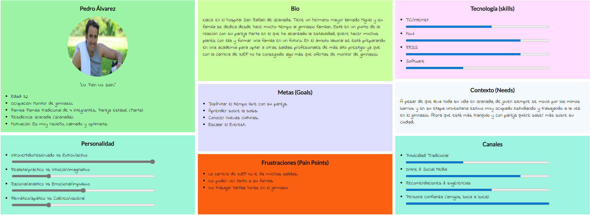
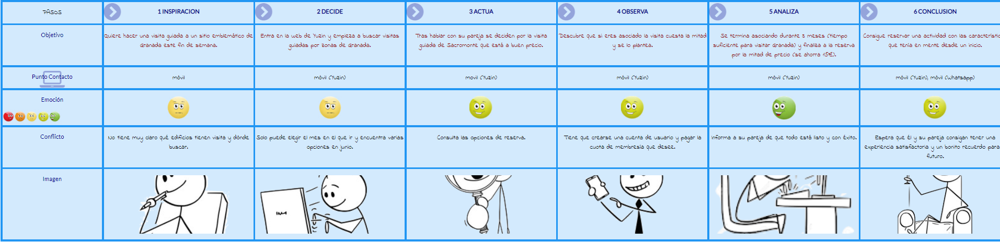
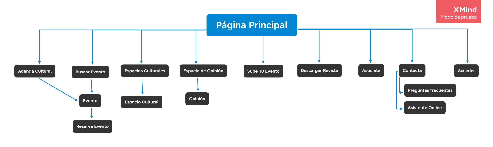
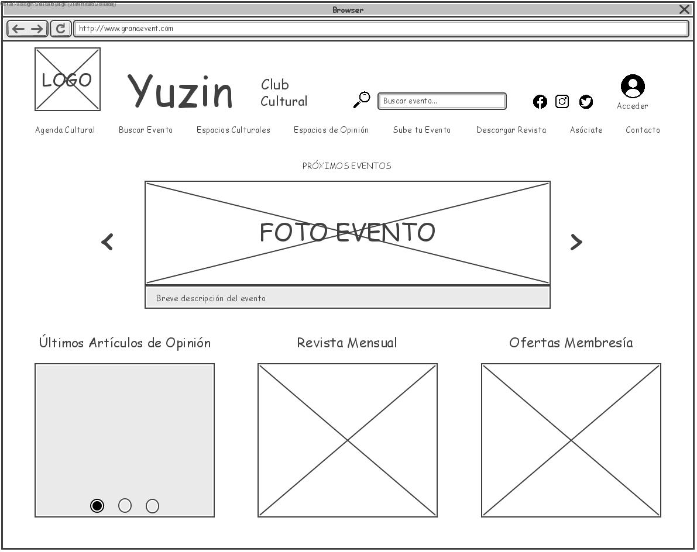
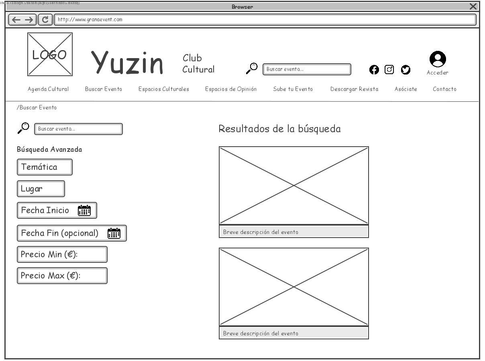
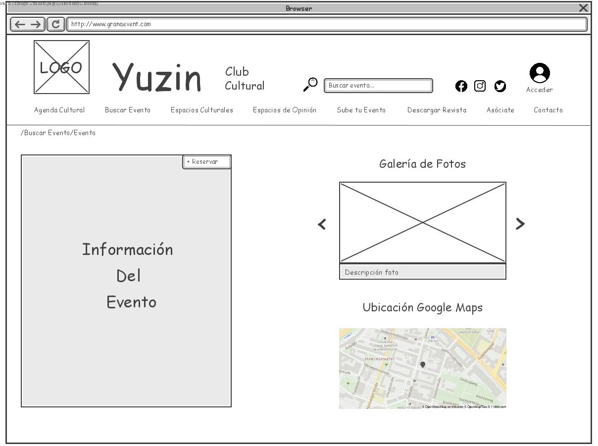

<h1 align="center">PARTE II Web Yuzin</h1>

<strong>Autor:</strong> Ángel Solano Corral

<strong>Caso de estudio:</strong> Yuzin Club Cultural

<strong>Proyecto Rediseño:</strong> Granevent 

<strong>Descripción: </strong>El sitio web Granevent tiene el objetivo de facilitar la actividad cultural en las ciudades de Sevilla y Granada. Puedes descargarte una revista con todos los eventos del mes, publicitar tu propio evento, reservar entradas, buscar eventos con todo tipo de facilidades, echar un vistazo a artículos de opinión sobre cultura, turismo, etc. 

---

<h2 align="justify">Descripción del caso de estudio</h2>

El objetivo de Yuzin Club Cultural es promover la actividad cultural en las ciudades de Sevilla y Granada. La web ofrece distintas opciones entre las que podemos encontrar la de anunciar tu propio evento, consultar la agenda cultural, descargar una copia de la revista (fecha a elegir), una búsqueda personalizada de actividades, reserva de tickets ...

A continuación se prodecerá a realizar un proceso de rediseño con el objetivo de mejorar la web del caso de estudio. 

# Proceso de Rediseño 

## Paso 1. Análisis

Analizaremos el sitio web para sacar sus puntos fuertes y debilidades con el objetivo de saber lo que tenemos que mejorar en el rediseño.

### 1.a Competitive Analysis

Comparo Yuzin Club Cultural con otros sitios web de la misma temática para ver qué tienen sus competidores de más y de menos. Los páginas que he usado son:

<a href="https://www.turgranada.es/">Turgranada</a>: Ofrece una agenda de actividades culturales en toda la provincia de Granada entre otras funcionalidades (planear tu viaje, búsqueda de destinos ...)

<a href="https://www.sevillaguia.com/">Sevillaguia</a>: Se centra en actividades culturales en la ciudad de Sevilla y puedes acceder a un gran número de ellas, publicitar la tuya propia, el servicio de venta de tickets está deshabilitado temporalmente ...

Puedes ver el análisis competitivo <a href="https://github.com/angelsc21/DIU_Trabajo_Final/blob/main/CompetitiveAnalisis.pdf">aquí</a>.

Lo más importante es que hemos podido conseguir información importante sobre aspectos que faltan en la web cómo serían una búsqueda más personalizada, mapa del evento, descripción del evento más completa, cambio de idioma, conversión de moneda y la ventaja que supondría tener una app móvil sobre nuestros competidores.

### 1.b Persona

Utilizo el siguiente perfil para simular una posible experiencia de usuario y recabar más información sobre las dificultades, emociones, frustraciones ... que experimenta.

### 1.c Journey Map

Hemos simulado que esta persona quiere reservar un tour guiado por un sitio emblemático en Granada.

Lo útil que hemos sacado de este viaje sería que no puedes elegir la fecha con exactitud y que la suscripción es muy tentadora (suele funcionar para aquellos usuarios que visiten la web frecuentemente). En conclusión, podríamos mejorar la interfaz con la que tenemos el primer contacto para que la búsqueda sea algo más personalizable y de una mejor impresión.

### 1.d Usability Review

Puedes ver los resultados <a href="https://github.com/angelsc21/DIU_Trabajo_Final/blob/main/Usability-review.pdf">aquí</a>.

<strong>Valoración final: 61</strong>

Según los parámetros del test los usuarios deben poder usar este sitio o sistema con relativa facilidad y deben ser capaces de completar la gran mayoría de las tareas importantes. Su principal desventajas se encuentran en la organización de la página principal, tienes que pararte a ver el menú para descubrir qué ofrece realmente la página. Otras opciones que se podrían añadir serían la de valorar una actividad, ofrecer un mapa sobre el sitio del evento, mejorar la ayuda cuándo hay errores... 

## Paso 2. UX Design

### 2.a Malla receptora de información

Utilizo esta herramienta para tener una visión global de las partes más interesantes de Yuzin Club Cultural, críticas, preguntas sin resolver y nuevas ideas que pueden aportar cosas positivas. Con estas información ya podré empezar con el rediseño del sitio-web.

| 
<strong>Interesante</strong>
 | 
<strong>Críticas</strong>
|  
| ------------- | -------|
| Puedes acceder a todo lo que ofrece la página desde el menú principal.| La ayuda frente a errores no es exacta, aporta información muy general.|
| La página principal tiene una interfaz sencilla y legible.| El soporte de contacto es bastante limitado.|
| El proceso de reserva es muy sencillo.| No existe un mapa para localizar más fácilmente evento.|
| La membresía ofrece una gran ventaja a aquellos que utilicen la página con frecuencia.| La búsqueda tiene pocas opciones de personalización. |
| | No sabemos dónde estamos cuándo salimos del menú principal. |
| | La descripción del evento es muy básica. Faltaría añadir una galería de imágenes, información más exhaustiva... |
| 
<strong>Preguntas</strong>
 | 
<strong>Nuevas Ideas</strong>
 |
| ¿Cómo cancelar una reserva?¿Tiempo límite de cancelación? | Añadir más opciones de búsqueda. |
| ¿Tiene el evento medidas anti-covid? | Añadir un mapa de la ubicación del evento. |
| ¿Si tengo 'x' tiempo disponible, cómo busco eventos de unas determinadas horas? | Añadir la posibilidad de valorar un evento. |
| | Colocar el menú más centrado para que esté más a la vista. |
| | Poner a la vista las principales funcionalidades que ofrece la web en la página principal. |
| | Cuándo ocurra un error especificar exactamente cuál ha sido. |

### 2.a Propuesta de valor

La propuesta de valor presenta un proyecto llamado Granaevent cuyas principales características serán un rediseño completo de la página principal (plasmará el contenido principal que ofrece el sitio web, menú centrado, etc), adición de un mapa sobre el sitio del evento, búsqueda con mayor número de filtros, ayuda más precisa junto a un asistente online, valoración de eventos y una descripción más amplia de los mismos.

### 2.b Sitemap + Labelling

* Sitemap 

En el sitemap podemos ver que nos ha quedado una estructura bastante sencilla en la que puedes acceder prácticamente a todas las funcionalidades de la página con un solo clic.

* Labelling 

| 
<strong>Label</strong>
 |  
<strong>Scope Note</strong>
|
| ------------- | -------| 
| Página Principal | Página de inicio con la que se encuentra el usuario al entrar al sitio web | 
| Agenda Cultural | Lista de eventos ordenados cronológicamente | 
| Buscar Evento | Búsqueda personalizada de los eventos culturales | 
| Evento | Información de un evento en concreto  | 
| Reserva Evento | Formulario de reserva de un evento concreto   | 
| Espacios Culturales | Listado de espacios culturales | 
| Espacio Cultural | Espacio cultural en concreto | 
| Espacio de Opinión | Apartado de artículos de opinión sobre cultura, turismo...  | 
| Opinión | Descripción de un artículo de opinión en concreto | 
| Sube Tu Evento | Formulario para publicitar tu evento en la página | 
| Descargar Revista | Apartado de descarga de la revista física (se puede elegir la edición) | 
| Asóciate | Formulario de inscripción a la membresía Yuzin | 
| Contacta | Zona de contacto y ayuda  | 
| Preguntas frecuentes | Listado de preguntas respondidas que los usuarios suelen hacer | 
| Asistente Online | Asistente hecho con intelegencia artificial que interactúa contigo para ayudarte a resolver tus problemas  | 
| Acceder | Iniciar sesión en la página con tus datos  | 

### 2.c Wireframes

A continuación muestro una serie de wireframes en los que se pueden ver algunas zonas del rediseño de la página.

* Homepage

* Buscar Evento

* Evento

## Paso 3. Guidelines y Patrones de Diseño

Una vez expuesto los bocetos, se pasaría a realizar un diseño más profesional enfocado al resultado final. Para un correcto procedimiento se deberían de elegir previamente los Guidelines y Patrones de Diseño.
 

Sería conveniente utilizar 2 variantes de tipografías, una para los títulos (MontSerrat ha sido testada en mi práctica y encajaba bastante bien) y otra para el texto básico (NotoSans sería una buena opción).
 

La creación de un logo acorde con el contenido de la página y el uso de una paleta de colores más elaborada (previamente testada con reviews de accesibilidad) atraería a más clientes.

Otro punto a favor para la empresa sería tener una aplicación móvil además del sitio web para dotar de una mayor versatilidad a los recursos ofrecidos.

## Conclusiones

El rediseño que se hizo en su momento de Yuzin Club Cultural en muchos aspectos dejaba mucho que desear. Creo que no plasmaron lo que querían ofrecer en la página principal y eso hizo que la gente no entendiera del todo el objetivo del sitio web. Con esta nueva propuesta de Granevent, se busca ofrecer al cliente  aquello que más importante que ofrece la empresa desde el principio. Se han completado muchos aspectos cómo la búsqueda, descripción del evento ... que proporcionarán al usuario una mejor experiencia y que probablemente le hagan volver a visitar la página. Granevent todavía puede mejorarse aún más adoptando ideas que se han dejado previamente cómo la creación de una app, consejos de diseño para la presentación final ... y también sería conveniente hacer un estudio de accesibilidad para acceder a ese pública ya no tan minoritario que probablemente tenga serios problemas al usar el sitio web.

