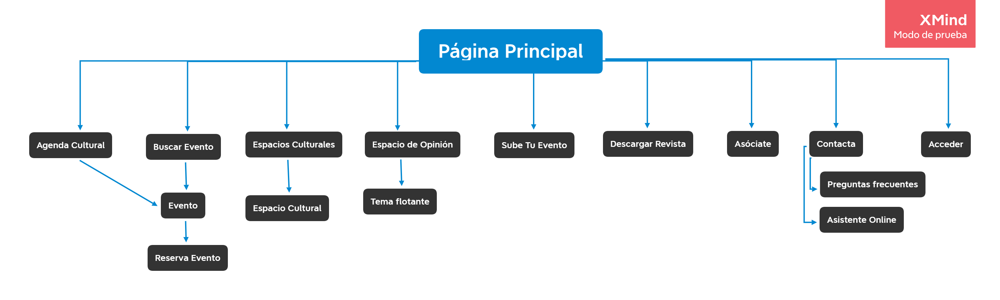

<h1 align="center">PARTE II Web Yuzin</h1>

<strong>Autor:</strong> Ángel Solano Corral

<strong>Caso de estudio:</strong> Yuzin Club Cultural

<strong>Proyecto Rediseño:</strong> Granevent

<strong>Descripción:</strong> 

---

<h2 align="justify">Descripción del caso de estudio</h2>
El objetivo de Yuzin Club Cultural es promover la actividad cultural en las ciudades de Sevilla y Granada. La web ofrece distintas opciones entre las que podemos encontrar la de anunciar tu propio evento, consultar la agenda cultural, descargar una copia de la revista (fecha a elegir), una búsqueda personalizada de actividades, reserva de tickets ...

A continuación se prodecerá a realizar un proceso de rediseño con el objetivo de mejorar la web del caso de estudio. 

# Proceso de Rediseño 

## Paso 1. Análisis

Analizaremos el sitio web para sacar sus puntos fuertes y debilidades con el objetivo de saber lo que tenemos que mejorar en el rediseño.

### 1.a Competitive Analysis

Comparo Yuzin Club Cultural con otros sitios web de la misma temática para ver qué tienen sus competidores de más y de menos. Los sitios con los que he comparado el sitio web son:

Turgranada: Ofrece una agenda de actividades culturales en toda la provincia de Granada entre otras funcionalidades (planear tu viaje, búsqueda de destinos ...)

Sevillaguia: Se centra en actividades culturales en la ciudad de Sevilla y puedes acceder a un gran número de ellas, publicitar la tuya propia, el servicio de venta de tickets está deshabilitado temporalmente ...

Puedes ver el análisis competitivo <a href="https://github.com/angelsc21/DIU_Trabajo_Final/blob/main/CompetitiveAnalisis.pdf">aquí</a>.

### 1.b Persona

Utilizo el siguiente perfil para simular una posible experiencia de usuario y recabar más información sobre las dificultades, emociones, frustraciones ... que experimenta.

### 1.c Journey Map

Hemos simulado que esta persona quiere reservar un tour guiado por un sitio emblemático en Granada.

Lo útil que hemos sacado de este viaje sería que no puedes elegir la fecha con exactitud y que la suscripción es muy tentadora (suele funcionar para aquellos usuarios que visiten la web frecuentemente). En conclusión, podríamos mejorar la interfaz con la que tenemos el primer contacto para que la búsqueda sea algo más personalizable y de una mejor impresión.

### 1.d Usability Review

Puedes ver los resultados <a href="https://github.com/angelsc21/DIU_Trabajo_Final/blob/main/Usability-review.pdf">aquí</a>.

<strong>Valoración final: 61</strong>

Según los parámetros del test los usuarios deben poder usar este sitio o sistema con relativa facilidad y deben ser capaces de completar la gran mayoría de las tareas importantes. Su principal desventajas se encuentran en la organización de la página principal, tienes que pararte a ver el menú para descubrir qué ofrece realmente la página. Otras opciones que se podrían añadir serían la de valorar una actividad, ofrecer un mapa sobre el sitio del evento, mejorar la ayuda cuándo hay errores... 

## Paso 2. UX Design

### 2.a Malla receptora de información

Utilizo esta herramienta para tener una visión global de las partes más interesantes de Yuzin Club Cultural, críticas, preguntas sin resolver y nuevas ideas que pueden aportar cosas positivas. Con estas información ya podré empezar con el rediseño del sitio-web.

| 
<strong>Interesante</strong>
 | 
<strong>Críticas</strong>
|  
| ------------- | -------|
| Puedes acceder a todo lo que ofrece la página desde el menú principal.| La ayuda frente a errores no es exacta, aporta información muy general.|
| La página principal tiene una interfaz sencilla y legible.| El soporte de contacto es bastante limitado.|
| El proceso de reserva es muy sencillo.| No existe un mapa para localizar más fácilmente evento.|
| La membresía ofrece una gran ventaja a aquellos que utilicen la página con frecuencia.| La búsqueda tiene pocas opciones de personalización. |
| | No sabemos dónde estamos cuándo salimos del menú principal. |
| | La descripción del evento es muy básica. Faltaría añadir una galería de imágenes, información más exhaustiva... |
| 
<strong>Preguntas</strong>
 | 
<strong>Nuevas Ideas</strong>
 |
| ¿Cómo cancelar una reserva?¿Tiempo límite de cancelación? | Añadir más opciones de búsqueda. |
| ¿Tiene el evento medidas anti-covid? | Añadir un mapa de la ubicación del evento. |
| ¿Si tengo 'x' tiempo disponible, cómo busco eventos de unas determinadas horas? | Añadir la posibilidad de valorar un evento. |
| | Colocar el menú más centrado para que esté más a la vista. |
| | Poner a la vista las principales funcionalidades que ofrece la web en la página principal. |
| | Cuándo ocurra un error especificar exactamente cuál ha sido. |

### 2.a Propuesta de valor

La propuesta de valor presenta un proyecto llamado Granaevent cuyas principales características serán un rediseño completo de la página principal (plasmará el contenido principal que ofrece el sitio web, menú centrado, etc), adición de un mapa sobre el sitio del evento, búsqueda con mayor número de filtros, ayuda más precisa junto a un asistente online, valoración de eventos y una descripción más amplia de los mismos.

### 2.b Sitemap + Labelling

* Sitemap 

* Labelling 

| 
<strong>Label</strong>
 |  
<strong>Scope Note</strong>
|
| ------------- | -------| 
| Página Principal |   | 
| Agenda Cultural |   | 
| Buscar Evento | Información sobre la empresa detrás de la aplicación  | 
| Evento | Identificación del usuario en la plataforma  | 
| Reserva Evento | Apartado de acceso único a usuarios registrados en el que podrán gestionar sus grupos, actividades ...   | 
| Espacios Culturales | Panel que clasifica los grupos del usuario y la opción de crear uno | 
| Espacio Cultural | Grupos a los que se ha unido el usuario | 
| Espacio de Opinión | Grupos que ha creado el usuario | 
| Opinión | Interfaz de creación de grupo | 
| Sube Tu Evento | Panel que clasifica las actividades del usuario y la opción de crear una | 
| Descargar Revista | Actividades reservadas por el usuario | 
| Asóciate | Actividades creadas por el usuario  | 
| Contacta | Interfaz de creación de actividad  | 
| Preguntas frecuentes | Lista de amigos del usuario | 
| Asistente Online | Perfil de usuario con información personal  | 
| Acceder | Chat del usuario en el que se muestran las conversaciones  | 
